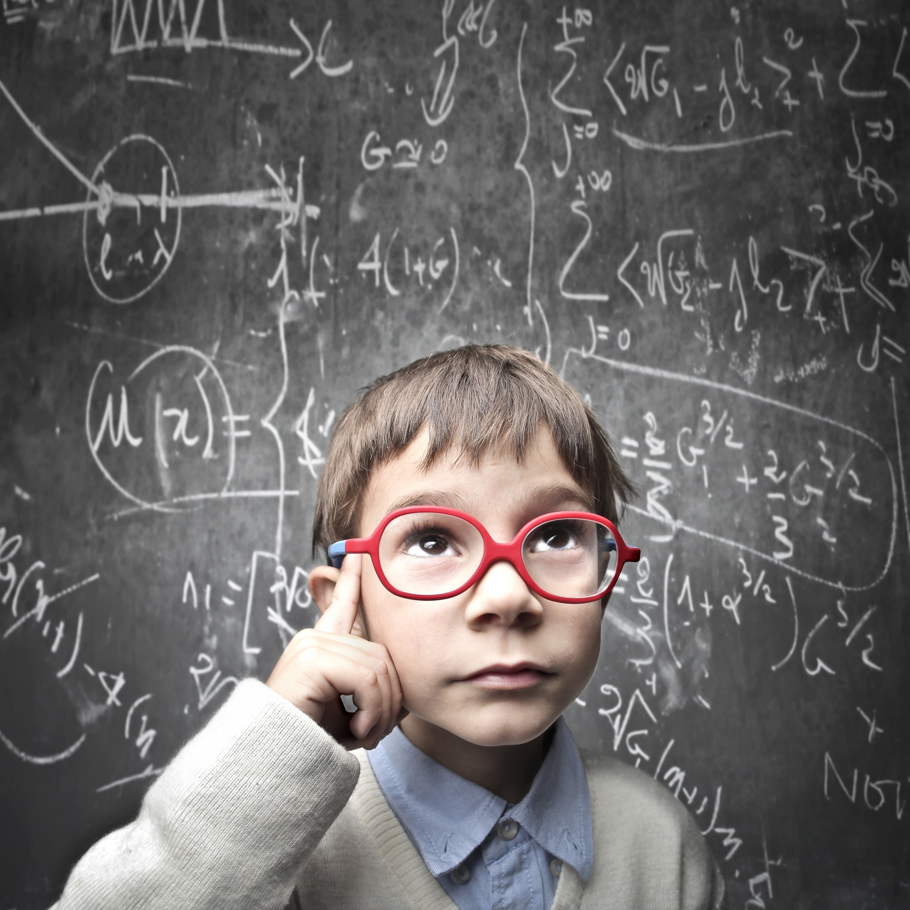

# В чем проблема изучения математики?

И так в чем проблема изучения данного предмета? Математика развивает умственное мышление человека.Часто именно математика дарит ребенку откровение, что взрослые не всемогущи и знают далеко не все. Так бывает, когда мама или папа на просьбу помочь решить задачку лишь разводят руками и объявляют о своей неспособности это сделать. И ребенок вынужден сам искать ответ, ошибаться и снова искать. Бывает и так, что родители просто отказываются помочь. «Ты должен сам», — говорят они. И правильно делают. После многочасовых попыток ребенок получит не просто сделанное домашнее задание, но способность самостоятельно находить решения, обнаруживать и исправлять ошибки. И в этом также кроется роль математики в жизни человека. Конечно, самостоятельность, умение принимать решения, отвечать за них, отсутствие страха перед ошибками вырабатываются не только на уроках алгебры и геометрии. Но эти дисциплины играют в процессе немалую роль. Математика воспитывает такие качества, как целеустремленность и активность. Правда, многое зависит и от учителя. Неправильная подача материала, излишняя строгость и давление могут, наоборот, привить страх перед трудностями и ошибками (сначала на уроках, а потом и в жизни), нежелание высказывать свое мнение, пассивность.

Также актуальная проблема изучения математики является не подготовленное домашнее задание. Учитель рассказывает новую тему, на уроке прорабатываются упражнения на укрепление нового материала. К концу урока учитель выдает домашнее задание к следующему уроку на закрепление нового материала. Придя домой после тренировок уставший ученик садится делать домашние задание. Выполняя его он чего-то не понимает. «Я не понимаю, для чего нужна математика!», отбрасывает в сторону ненавистные сложные и нудные задачки и садится играть в компьютер. Не закрепив материал становится трудно изучать последующий материал, ведь без одной темы не поймешь другую тему, а без другой не поймешь дальнейшие. Математика развивает умственное мышление человека,учит находить причинно-следственные связи, закладывает привычку искать пресловутое «откуда ноги растут». Внимание, сосредоточенность, сила воли — они также тренируются в процессе решения тех самых ненавистных задачек.