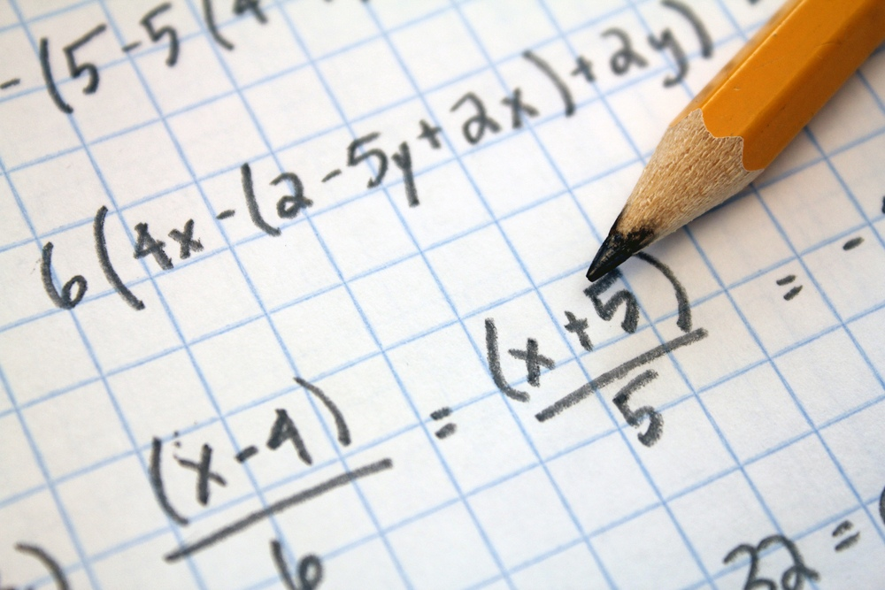

# Введение

Для начала стоит понять, что вообще представляет собой  математика. В переводе с древнегреческого само ее название означает «наука», «изучение». В основе математики лежат операции подсчета и измерения. Умение считать это ещё не все в математике. Для того чтобы понимать математику нужно умение хорошо выражать свои мысли, понимание задач и установление связи между фактами.

Математика изучает числа, пространственные формы и количественные отношения.

 Значимая роль математических наук и в общеобразовательной системе, и в жизни  очевидна. Сегодня достаточно сложно представить какое-либо направление в науке или искусстве не используемое хоть чуть-чуть математики . Универсальное свойство математики заключается в том, что это область знаний, смысл которых заключается в операциях с абстрактными сущностями и их взаимосвязями. Тем не менее, эти знания и умения легко и эффективно применяются в любой узконаправленной жизнедеятельности. Математика совершенно чудесно описывает нашу с вами жизнь. Законы физики, химии, биологии в своем большинстве представляют собой численные соотношения, соотношения множеств, фигур и других абстрактных объектов, которыми занимается математика. Даже такие молодые дисциплины, как экономика или социология не могут без математики. Школа должна дать выпускнику всё необходимое для выбора жизненной тропы. И без базовых знаний математики огромный ряд этих троп будет недоступен.Взрослые люди после окончания университета или колледжа не перестают каждый день решать математические задачи. Как успеть на поезд? Получится ли из килограмма мяса приготовить ужин для десяти гостей? Сколько калорий в блюде? На какое время хватит одной лампочки? Эти и многие другие вопросы имеют прямое отношение к математике и без нее не решаются. Получается, математика в нашей жизни незримо присутствует практически постоянно. Причем чаще всего мы этого даже не замечаем. Как уже говорилось     некоторые  профессии без нее немыслимы, многие появились только благодаря развитию отдельных ее направлений. Современный технический прогресс тесно связан с усложнением и развитием математического аппарата. Компьютеры и телефоны, самолеты и космические аппараты никогда бы не появились, не будь людям известна царица наук. Однако роль математики в жизни человека этим не исчерпывается. Наука помогает ребенку осваивать мир, обучает более эффективному взаимодействию с ним, формирует мышление и отдельные качества характера. Поэтому можно сделать вывод что математика очень важна в жизни человека так как без ее минимальных основ будет очень тяжело в дальнейшем.

В истории математики существует несколько классификаций истории математики, по одной из них выделяются несколько этапов развития математических знаний, одним из этих этапов является появление в древней Греции дедуктивной математической системы, показавшей, как получать новые математические истины на основе уже имеющихся. Венцом достижений древнегреческой математики стали Начала Евклида, игравшие роль стандарта математической строгости в течение двух тысячелетий.

В XVI—XVIII веках возрождается и уходит далеко вперёд европейская математика.

В XIX—XX веках становится понятно, что взаимоотношение математики и реальности далеко не столь просто, как ранее казалось.
